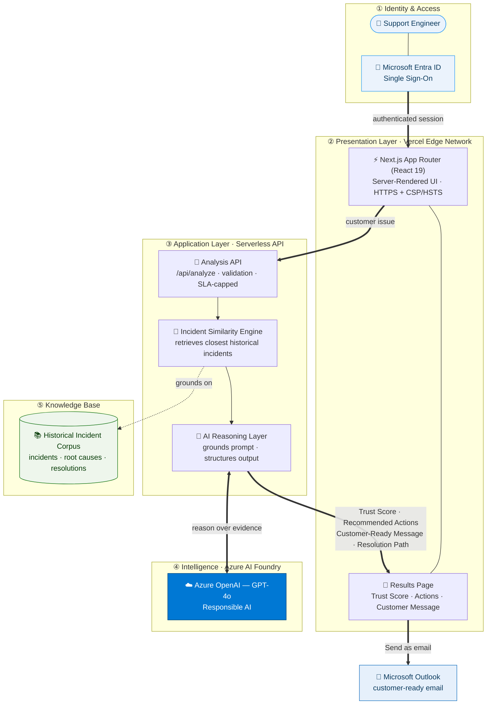

# Customer Compass — Architecture

Customer Compass turns Microsoft's historical support incidents into grounded,
customer-ready guidance. The system is a cloud-native, retrieval-grounded AI
application deployed on Vercel and powered by Azure AI Foundry.

## System Diagram

## End-to-End Flow

1. **Authenticate** — the support engineer signs in with Microsoft Entra ID (SSO).
2. **Submit** — they describe a customer issue in the Next.js web app on Vercel's edge.
3. **Retrieve** — the Incident Similarity Engine matches the issue against the
   historical incident corpus (incidents, root causes, resolutions).
4. **Reason** — the AI Reasoning Layer grounds a prompt on that evidence and calls
   Azure OpenAI (GPT-4o) to produce structured guidance.
5. **Present** — the Results page renders a Trust Score, recommended actions, a
   customer-ready message, and a resolution path.
6. **Act** — one click sends the customer-ready message as an email via Microsoft Outlook.

## Architectural Principles

- **Secure by default** — Entra ID SSO; all traffic over HTTPS with hardened
  security headers (CSP, HSTS) on Vercel's global edge.
- **Retrieval-grounded intelligence** — answers are grounded in real precedent
  rather than generated from scratch, improving trust and accuracy.
- **Structured, actionable output** — every analysis returns a consistent,
  decision-ready payload (Trust Score, actions, message, resolution path).
- **Cloud-native & resilient** — serverless API with enforced execution SLAs,
  deployed continuously to Vercel.
